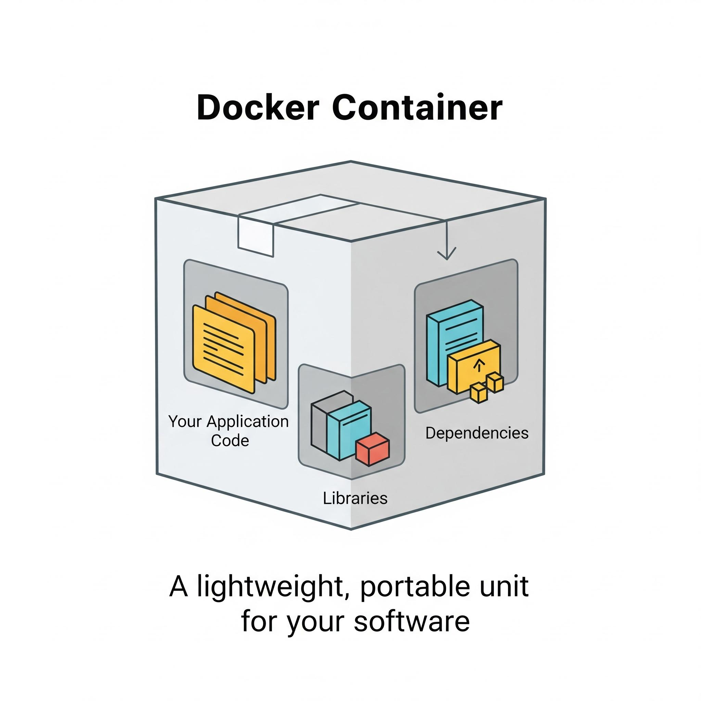
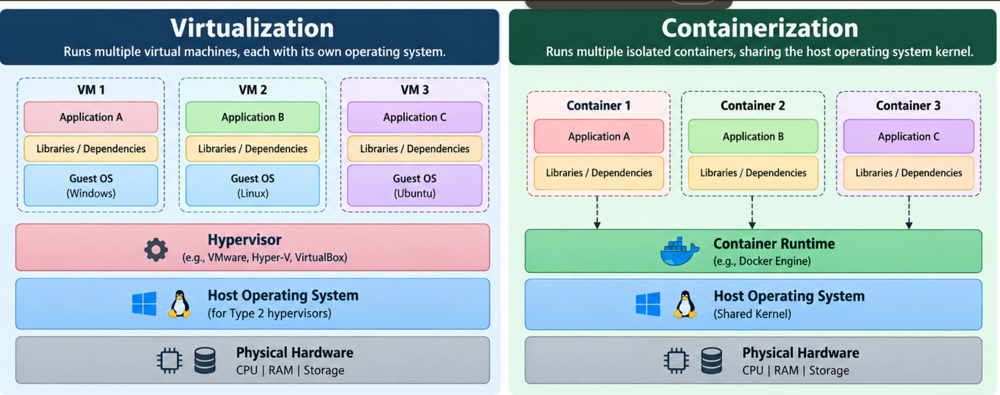

# Docker & Containerization

## 1. What is a Container?

A **container** is an isolated environment in which an application runs along with its required dependencies, libraries and runtime.

Containers help applications run consistently across different environments without manually installing all dependencies on each machine.

### Example

Suppose we have an application called ResolveIQ that requires:

- Python runtime
- Python libraries
- Application code
- Configuration
 .

---

## 2. What is a Hypervisor?

A **hypervisor** is a software or firmware layer that creates, runs and manages multiple virtual machines (VMs) on a single physical machine.

It allocates physical resources such as CPU, RAM and storage to virtual machines.

### Types of Hypervisors

#### Type 1 — Bare-Metal Hypervisor

- Runs directly on physical hardware without requiring a host operating system.
- Commonly used in data centers and enterprise environments.
- Generally provides efficient resource management.

**Examples:**

- VMware ESXi
- Microsoft Hyper-V

**Architecture:**

Physical Hardware → Hypervisor → Virtual Machines

#### Type 2 — Hosted Hypervisor

- Runs on top of an existing host operating system, such as Windows or Linux.
- Commonly used for learning, testing and development.

**Examples:**

- Oracle VirtualBox
- VMware Workstation

**Architecture:**

Physical Hardware → Host OS → Hypervisor → Virtual Machines

---

## 3. What is Virtualization?

**Virtualization** is the process of creating virtual versions of computing resources, such as servers, operating systems, storage and networks.

It allows multiple virtual machines (VMs) to run on a single physical machine using a hypervisor.

Each VM has:

- Its own guest operating system
- Allocated CPU and RAM
- Virtual storage
- Applications and dependencies

### Example

Suppose we have a Windows laptop and install Oracle VirtualBox.

Using VirtualBox, we can create an Ubuntu virtual machine that runs independently of the Windows host operating system.

---

## 4. What is Containerization?

**Containerization** is the process of packaging an application with its required dependencies into an isolated container.

Containers share the host operating system's kernel instead of running a separate guest OS for each application.

A container runtime, such as Docker Engine, manages the containers.

- Allows us to run multiple isolated applications on the same host without conflicts.

### Example

Suppose we have a Linux server.

Using Docker, we can run:

- A Python application in one container
- A database in another container
- A web server in a third container

All these containers can run on the same host while remaining isolated from one another.

---

## 5. Difference Between Virtualization and Containerization

| Virtualization | Containerization |
| --- | --- |
| Creates virtual machines (VMs). | Creates isolated containers. |
| Each VM has its own guest OS. | Containers share the host OS kernel. |
| Uses a hypervisor. | Uses a container runtime. |
| Generally consumes more resources. | Generally consumes fewer resources. |
| Usually takes longer to start. | Usually starts faster. |
| Virtualizes hardware to run multiple OS environments. | Isolates applications and their dependencies. |
| Example: VMware ESXi, VirtualBox. | Example: Docker. |
 

